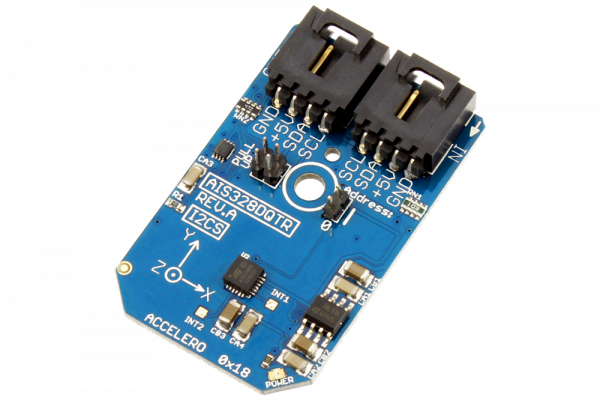

# AIS328DQTR

The AIS328DQ, manufactured by STMicroelectronics, is an ultra-low power high performance 3-axis linear accelerometer with an I2C interface.The AIS328DQ has dynamic user-selectable full-scales of ±2g/±4g/±8g and is capable of measuring accelerations with output data rates from 0.5 Hz to 1 kHz.
This Device is available from www.ncd.io 

[SKU: AIS328DQTR_I2CS]

(https://store.ncd.io/product/ais328dqtr-high-performance-ultra-low-power-3-axis-accelerometer-with-digital-output-for-automotive-applications-i2c-mini-module/)
This Sample code can be used with Arduino.

Hardware needed to interface AIS328DQTR sensor with Arduino

1. <a href="https://store.ncd.io/product/i2c-shield-for-arduino-nano/">Arduino Nano</a>

2. <a href="https://store.ncd.io/product/i2c-shield-for-arduino-micro-with-i2c-expansion-port/">Arduino Micro</a>

3. <a href="https://store.ncd.io/product/i2c-shield-for-arduino-uno/">Arduino uno</a>

4. <a href="https://store.ncd.io/product/dual-i2c-shield-for-arduino-due-with-modular-communications-interface/">Arduino Due</a>

5. <a href="https://store.ncd.io/product/ais328dqtr-high-performance-ultra-low-power-3-axis-accelerometer-with-digital-output-for-automotive-applications-i2c-mini-module/">AIS328DQTR 3-axis accelometer Sensor</a>

6. <a href="https://store.ncd.io/product/i%C2%B2c-cable/">I2C Cable</a>

AIS328DQTR:

The AIS328DQ, manufactured by STMicroelectronics, is an ultra-low power high performance 3-axis linear accelerometer with an I2C interface.The AIS328DQ has dynamic user-selectable full-scales of ±2g/±4g/±8g and is capable of measuring accelerations with output data rates from 0.5 Hz to 1 kHz.

Applications:

•Telematics and black boxes

•Tilt / inclination measurement

•Anti-theft devices

•Vibration monitoring and compensation

•Intelligent power saving

How to Use the AIS328DQTR Arduino Library
The AIS328DQTR has a number of settings, which can be configured based on user requirements.

1.Data rate selection:The following command selects the data rate for the accelometer as 50Hz.

       ais.setAccelDataRate(ACCEL_DATARATE_50HZ);              // AODR (Hz): 50
   
2.Output range of accelometer:The following command selects the maximum output range for the accelometer as ±2g.

       ais.setAccelRange(ACCEL_RANGE_2G);                      // ±2 G
